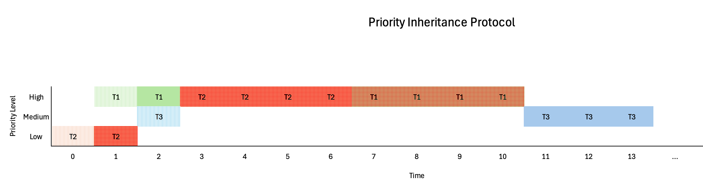
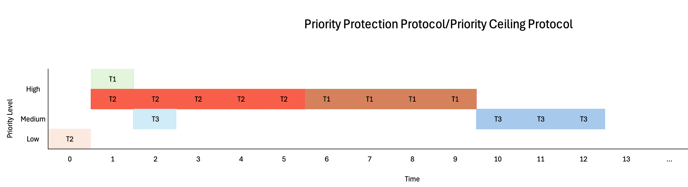

# EECE-5811-HW5

Priority Inversion, Priority Inheritance Protocol, &amp; Priority Ceiling Protocol + Virtual &amp; Physical Addressing

## Part 1

### Q1

Given:

- T1, T2, and T3 with priorities 1, 3, 2 respectively where 1 is the highest priority
- T1 and T2 need to access a shared resource R, and T3 does not

Consider the following scenario:

- T2 is running and holds the lock on resource R.
- T1 arrives and preempts T2 due to its higher priority, but cannot proceed because it needs access to R and T2 is holding the lock.
- T3 arrives and preempts T2 due to its higher priority. T3 runs to completion.
- T2 resumes and eventually releases the lock on R, allowing T1 to proceed.

Priority inversion occurs as a result of T1 being indirectly blocked by T3, which has a lower priority than T1.

### Q2

1. T2 takes 5 units to complete its critical section in both Priority Inheritance and Priority Protection protocols.
2. T2 completes its critical section first in both protocols. Comparing both protocols, T2 completes 1 unit earlier in Priority Protection protocol.
3. Assuming T1 runs for 1 unit after arriving and attempts to access the shared resource, the total execution time for Priority Inheritance Protocol is 13 units. Priority Protection Protocol has a total execution time of 12 units.
4. T1 does not experience priority inversion in either protocol.
5. In both PIP and PPP, T3 is scheduled to run after T2 completes even though T3 has an initial higher priority than T2. This is because T2's priority is elevated to high priority while it holds the lock on a shared resource needed by T1. Without PIP or PPP, T3 preempts T2 and runs to completion before T2 completes.

Below are the charts for both protocols:

#### Priority Inheritance Protocol (PIP)

#### Priority Protection Protocol (PPP)

#### Sources:

- https://www.ibm.com/docs/en/aix/7.3.0?topic=programming-synchronization-scheduling
- https://doc.segger.com/UM01001_embOS.html#Priority_inversion_priority_inheritance
- https://documentation.ubuntu.com/real-time/latest/explanation/priority-inversion-inheritance/
- https://wiki.linuxfoundation.org/realtime/documentation/technical_basics/pi
- https://www.digikey.com/en/maker/projects/introduction-to-rtos-solution-to-part-11-priority-inversion/abf4b8f7cd4a4c70bece35678d178321

## Part 2

1. 32-bit operating system, 4-KB pages, 1 GB of RAM
   - Virtual Address: `32 bits needed`
   - Physical Address: 1 GB RAM = 2`30` bytes, `30 bits needed`
   - Virtual Page Number: 4 KB = 2`12` bytes, `32 - 12 = 20 bits needed`
   - Physical Page Number: 1 GB RAM = 2`30` bytes, 4 KB = 2`12` bytes, `30 - 12 = 18 bits needed`
   - Offset: 4 KB = 2`12` bytes, `12 bits needed`
2. 32-bit operating system, 16-KB pages, 2 GB of RAM
   - Virtual Address: `32 bits needed`
   - Physical Address: 2 GB RAM = 2`31` bytes, `31 bits needed`
   - Virtual Page Number: 16 KB = 2`14` bytes, `32 - 14 = 18 bits needed`
   - Physical Page Number: 2 GB RAM = 2`31` bytes, 16 KB = 2`14` bytes, `31 - 14 = 17 bits needed`
   - Offset: 16 KB = 2`14` bytes, `14 bits needed`
3. 64-bit operating system, 16-KB pages, 16 GB of RAM
   - Virtual Address: `64 bits needed`
   - Physical Address: 16 GB RAM = 2`34` bytes, `34 bits needed`
   - Virtual Page Number: 16 KB = 2`14` bytes, `64 - 14 = 50 bits needed`
   - Physical Page Number: 16 GB RAM = 2`34` bytes, 16 KB = 2`14` bytes, `34 - 14 = 20 bits needed`
   - Offset: 16 KB = 2`14` bytes, `14 bits needed`
